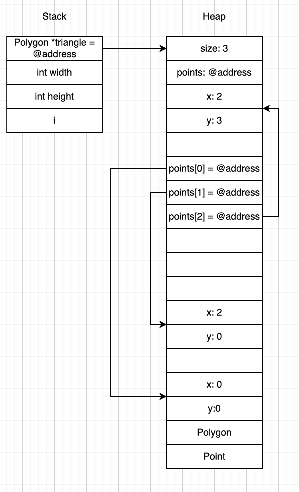

# Homework - C Practice Report

Completely answer the report questions below. Make sure to double check the final version to make sure it is easily readable on your github repository. 


1. What is the difference between a standard numeric type (int, float, double) and a pointer?
   1.int stores integers. It allocates 4 bytes for memory space.
   2.float stores single-precision float number. It allocates 4 bytes of memory space.
   3.double stores A double-precision float number. It allocates 8 bytes of memory space.
   4.a pointer stores the location of a object instead of the object itself. It allocates 4 bytes of memory space in 32-bit operating system and 8 bytes for 64-bit operating system. 
3. In your test file, we had the following code:
    
    ```c
    int* arr = create_array_of_ints_fib(5);
    int expected[] = {1, 1, 2, 3, 5};
    ```
    Later in the code we only `free(arr)` but not expected. Why is this? What is the difference in where they are stored in memory?
   In the code, we need to use ```c int *arr = (int*)malloc(size * sizeof(int));  ``` to allocate proper size for the array. Unlike ```cint arr[] = {1, 2, 3}``` which is stored at the stack, the malloc() allocate memory at the heap. The stack will automatically release the memory when the function ends, while heap will keep the memory until it reaches c```free(arr)``` code.
5. What is the difference between the heap and stack when related to memory allocation and management?
The heap allocates and store value permanently as long as there is no free() function. It can last longer than 1 function call. Hence, it can be use in senario when the data is needed in multiple functions. While stack allocates memory for temporal use. It will be automatically be freed after the function ends. 
6. Take the following code:
   ```c
   #include <stdio.h>
   #include <stdlib.h>

   typedef struct {
     int x, y;
   } Point;

   Point * new_point(int x, int y) {
     Point pt = {x, y};
     return &pt;
   }

   int main() {
      Point* point = new_point(10, 10);
      printf("x: %d, y: %d", point->x, point->y);
      return 0;
   }
   ```
   Would the code run correctly? Even if it does compile, what would be some potential runtime issues? After answering your thoughts, put the output of a run below (you may need to run it a few times).
   ```text
   x: 10, y: 10
   ```

   Fix the code in the following block:
   ```c
   #include <stdio.h>
   #include <stdlib.h>
   
   typedef struct {
       int x, y;
   } Point;
   
   Point * new_point(int x, int y) {
       Point *pt = (Point*)malloc(sizeof(Point));
       if (pt == NULL) {
           return NULL;
       }
       pt->x = x;
       pt->y = y;
       return pt;
   }
   
   int main() {
       Point *point = new_point(10, 10);
       printf("x: %d, y: %d", point->x, point->y);
       return 0;
   }


   ```

7. When you use `malloc`, where are you storing the information?
   The malloc stores information on heap. 
8. Speaking about `malloc` and `calloc`, what is the difference between the two (you may need to research it!)?

malloc takes 1 arguement. ex. (int*)malloc(sizeofdata) it allocates the amount of data you asked in the parenthesis. Moreover, malloc does not does not initialize the memory it allocates. The memory block contains garbage values.  Calloc takes 2 arguments ex. calloc(3, 4)  argument here mean there are 3 elements, and each element will be assigned 4 bytes of memory. Also, the calloc initialize each elements to 0. 
9. What are some common built in libraries used for C, list at least 3 and explain each one in your own words. Name a few (at least 3) functions in those libraries (hint: we used two of the most common ones in this assignment. There are many resources online that tell you functions in each library - you need to include at least 1 reference, but ideally for every library, you should have a reference to it)?
   - Example: stdlib.h - provides functions for general-purpose operations including
              memory management and random numbers [1].
     - void * malloc(size_t) - allocates memory specified in size on the heap and returns a pointer to that location
     - void * calloc(size_t num_elements, size_t element_size) - contiguous allocation for allocating arrays with the default value of 0. Slower than malloc. 
     - int rand(void) - returns a random integer between 0 and RAND_MAX. Seed should be set before hand. 
   1. math.h - provides common mathematical calculations that are more complex than basic arithmetic.
      * float fabs - Floating-point Absolute Value. It returns absolute value of an argument in floating-point number. 
      * double sqrt(double x) - Returns the square root of a non-negative number x.
      * double pow(double base, double exponent) - Returns the value of a base raised to the power of an exponent (base^exponent).
   
   2. string.h
      * size_t strlen(const char *str) - Calculates the length of a string by counting the number of characters until it finds the null terminator.
      * int strcmp(const char *str1, const char *str2) - Compares two strings lexicographically. It returns 0 if they are identical, a negative value if str1 comes before str2, and a positive value if str1 comes after str2.
      * char *strcpy(char *dest, const char *src) - Copies the string from a source (src) to a destination (dest), including the null terminator.
 
   3. stdio.h 
      * printf() - Prints formatted text to the standard output.
      * scanf(const char *format, ...) - Reads and parses formatted input from the standard input. 
      * fopen(const char *filename, const char *mode) - Opens a file specified by filename in a certain mode. 
 

10. Looking at the struct Point and Polygon, we have a mix of values on the heap, and we make ample use of pointers. Take a moment to draw out how you think that looks after `create_triangle(2,3)` is called (see an example below). The important part of the drawing it to see that not everything is stored together in memory, but in different locations! Store the image file in your github repo and link it here. You can use any program to draw it such as [drawIO](https://app.diagrams.net/), or even draw it by hand and take a picture of it. 


## Technical Interview Practice Questions
For both these questions, are you are free to use what you did as the last section on the team activities/answered as a group, or you can use a different question.

1. Select one technical interview question (this module or previous) from the [technical interview list](https://github.com/CS5008-khoury/Resources/blob/main/TechInterviewQuestions.md) below and answer it in a few sentences. You can use any resource you like to answer the question.
What is a pointer? What is the relationship between pointers and arrays in C?

The pointer is a variable that holding a memory address where a piece of data is stored. An array is a data structure that stores a collection of items, all of the same data type, in a single, continuous block of memory. The name of array acts a little bit like a pointer. It stores the address of the first element in array. In most cases the name of array automatically converts into a pointer to its first element. The major difference is the array is that the array name is a constant. It is permanently fixed to the start of its memory block. You cannot change what it points to, while the pointer is a variable. You can change what it points to.


2. Select one coding question (this module or previous) from the [coding practice repository](https://github.com/CS5008-khoury/Resources/blob/main/LeetCodePractice.md) and include a c file with that code with your submission. Make sure to add comments on what you learned, and if you compared your solution with others.

     Missing Number
```c
int missingNumber(int* nums, int numsSize) {
  
    int expected_sum = 0;
    for (int i = 0; i<=numsSize; i++){ 
        expected_sum += i;
    }
    /*
     * I learned the array name here nums can be directly be used without using * to dereferences that address to get the value stored inside the array. 
    /*
    
    int sum_of_nums = 0;
    for (int j = 0; j < numsSize; j++) {
        sum_of_nums += nums[j];
    }
    
    return expected_sum - sum_of_nums;
}
```
## Deeper Thinking
In Java and Python, do you think new objects are stored on the stack or the heap? Feel free to work through your thoughts as to why it would be better to store them on the stack or heap. You should consider pass by reference, and how that is similar to pointer in your answer. Feel free to use resources, but make sure to cite them, and include the citation below using ACM format. You will note LLMs are not valid references, but they can give you directions to valid references. Make sure to use your own words. 

Answer here using a paragraph (not just bullet points). 

In Java and Python, object instances are stored on the heap, while object references and primitive data types are stored on the stack. When an object is passed as a parameter, what is actually passed is a copy of its reference on the stack (a copy of the reference), rather than a copy of the entire object. It is similar to the pointer wile the pointer is often stored at the stack, but the memory object it point to is often at the heap. 

1. Lindholm, T., Yellin, F., Bracha, G., and Buckley, A. 2023. The Java® Virtual Machine Specification, Java SE 21 Edition. Oracle America, Inc. Retrieved from https://docs.oracle.com/javase/specs/jvms/se21/html/jvms-2.html#jvms-2.5

2. Scott, M. L. 2015. Programming Language Pragmatics, Fourth Edition. Morgan Kaufmann Publishers Inc., San Francisco, CA, USA. (Chapter 8 covers stack and heap allocation).
 
3. Python Software Foundation. 2025. 3. Data model. Python 3.13.0 documentation. Retrieved October 9, 2025 from https://docs.python.org/3/reference/datamodel.html

4. Bloch, J. 2018. Effective Java, Third Edition. Addison-Wesley Professional. (Chapter 2 provides insights into object creation and destruction, which is directly related to memory management).


## References
Add any references you use here. Use ACM style formatting, adding to the numbers as you add the reference. 

1. cppreference.com Contributors. 2025. Standard library header <stdlib.h>. cppreference.com. Retrieved May 1, 2025 from https://en.cppreference.com/w/c/header/stdlib

2. cppreference.com contributors. 2025. Common mathematical functions. cppreference.com. Retrieved October 9, 2025 from https://en.cppreference.com/w/c/numeric/math


3. cppreference.com contributors. 2025. Null-terminated byte strings. cppreference.com. Retrieved October 2, 2025 from https://en.cppreference.com/w/c/string/byte


4. Free Software Foundation. 2025. The GNU C Library (glibc) manual. Sourceware (GNU Project). Retrieved October 5, 2025 from https://sourceware.org/glibc/manual/

## Resource/Help: Linking to images?
To link an image, you use the following code

```markdown

```
for example
```markdown

```


Here is a sample using: 
```c
void my_func() {
    Polygon* r = create_rectangle(5,5);
    printf("The area of the rectangle is %d\n", area(r));
}
```


Note: This is a simplified version. However, it helps illustrate why we need to use `free` on the pointers in the struct. If we do not, we will have memory leaks! (memory that is allocated, but not freed, and thus cannot be used by other programs). In the above example code, `r` is created, and then the variable is destroyed when the function ends. However, the memory allocated for the struct is not freed, and thus we have a memory leak.

When you work on your version for `create_triangle(2, 3)`, you do not have to be exact on the memory structure (the locations on the heap were randomly chosen). The idea is more to show how the memory is stored, and the pointers to different memory addresses. 

